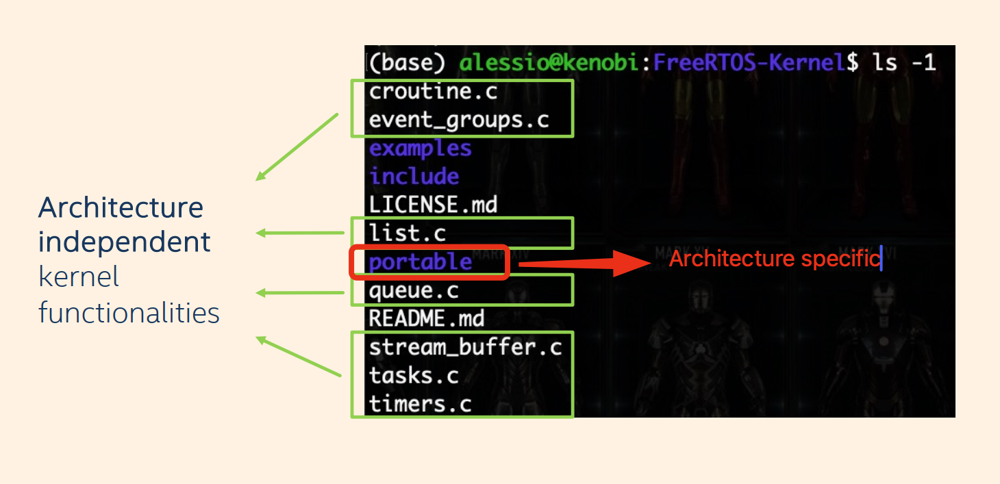
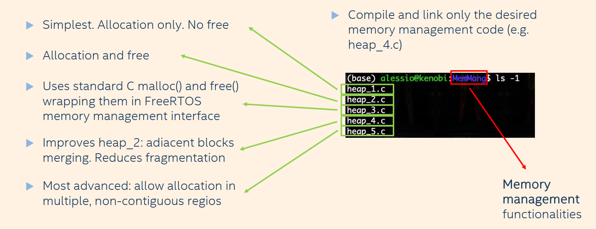
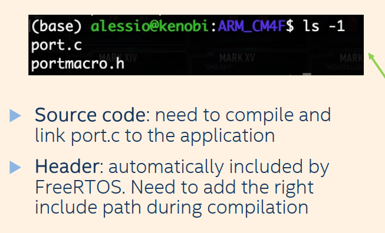

# Introduction to FreeRTOS

## ok, when I write this, I tired as sag so may I have a lot issues in my writing and spelling.

## OUTLINE

- What is a Real-Time Application (RTA)?
- What is a Real-Time Operating System (RTOS)?
- RTOS vs General Purpose Operating System (GPOS)
- What is FreeRTOS?
- FreeRTOS kernel
- FreeRTOS configuration
- FreeRTOS demos
- First operations with FreeRTOS

## REAL TIME AREA

### WHAT IS A REAL-TIME APPLICATION (RTA)

For a real time application we have new things which they are important too:

1. completion time
2. Predictability, the speed is not most important thing, the predictability is most important thing. We need a constant response time.

we have to type of the real time applications:

1. Hard real time
   - strict time deadline
   - missing the deadline cause catastrophic damages. (air bag)
2. Soft real time
   - time deadline
   - delay is tolerable (video streaming)

### WHAT IS A REAL-TIME OPERATING SYSTEM (RTOS)

- Operating system designed to reach time requirements
- Applications executed with very precise and deterministic timing

### RTOS vs General Purpose Operating System (GPOS)

| Real-Time Operating System (RTOS)                | General Purpose Operating System (GPOS)    |
| ------------------------------------------------ | ------------------------------------------ |
| Priority-based preemptive scheduling             | Scheduling for performance                 |
| Bounded interrupt and scheduling latency         | Unbounded interrupt and scheduling latency |
| Accepts lower throughput in favor of determinism | Maximizes throughput                       |
| Minimal kernel                                   | Larger kernel with more features           |

## What is FreeRTOS?

FreeRTOS is a lightweight **real-time** **FLAT operating system** built for embedded systems with limited resources. It provides **deterministic** scheduling, a tiny low-power kernel, and a small memory footprint. FreeRTOS is **open-source** and **portable**, and consists of modular functions that are linked into the final executable to provide OS features. It offers fast execution, low overhead, and extensive documentation, making it suitable for resource-constrained real-time applications.

### FreeRTOS kernel

ok, this is important part.
For this part we have some terms

- Architecture dependent
- Architecture independent

FreeRTOS has a kernel that is mostly `architecture-independent`.

What is architecture-independent ?  
The architecture-independent means most of its code works on any Microcontroller, and only a small part needs to be adapted for each CPU architecture.

When we realize free-rtos is suitable for independent architecture purpose, we must figure out how this happens.

So we deep going about the files of the kernel:

_notes, we have another architecture independent folder inside the portable which is `MemMang`_

In general, FreeRTOS codes and folders separate between our two needs.

#### Architecture-independent:

- They implement the OS behavior in plain C, and they work across all platforms. everything outside the `portable` folder is architecture independent thing.

#### Architecture-dependent:

Everything inside the portable folder used for architecture dependent needs. even the MemMang.

- It contains `CPU-specific` code such as:
  - Context switching
  - Interrupt handling
  - Low-level register operations

---

#### MemMang

MemMang used for memory management and it is replaced `malloc` and `free` function of the c programming.
Inside this folder we have these functions:

We usually use `heap_4.c`. it satisfies our free and malloc functions without fragmentation issue.

---

#### Building FreeRTOS: Essential Steps

- Select the correct architecture folder inside `portable/` (e.g., `portable/GCC/ARM_CM4F/` for a Cortex-M4F using GCC).
- Compile the architecture-specific source file (`port.c`) and include it in your project.
- Add the corresponding include path so `portmacro.h` is found during compilation.
- Combine these architecture-specific files with the generic FreeRTOS kernel sources (e.g., `tasks.c`, `queue.c`, `timers.c`, etc.) to complete the build.

