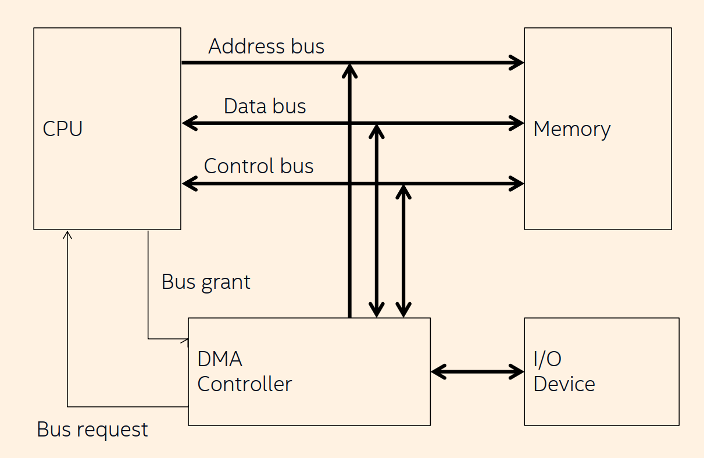
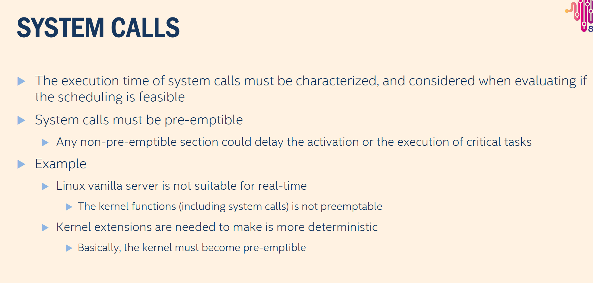

# SCHEDULING PREDICTABILITY

Predictability: the OS should guarantee that all critical timing constraints are met
Predictability requires _determinism_

Deterministic algorithm is an algorithm which, given a _particular input_, will always produce the _same output_, with the underlying machine always passing through the same sequence of states

And now we have seven source of nondeterminism

1. Direct memory access (DMA)
2. Cache memory
3. Interrupts
4. System calls
5. Semaphores
6. Memory management
7. Programming language

## Direct Memory Access (DMA)

DMA is used by many peripheral devices to transfer _data_ between the _device_ and the _main memory_

What is the mainly job of the DMA?

It relieves the CPU of the task of controlling the I/O transfer

The CPU and the I/O device share the same bus

The CPU is blocked when the DMA device is performing a data transfer

 

_This diagram explains how Direct Memory Access (DMA) allows data to move between memory and an I/O device without the CPU copying the data itself._

| **Bus Type**    | **Purpose**                                                                  |
| --------------- | ---------------------------------------------------------------------------- |
| **Address Bus** | Selects the memory or I/O address (one-way: CPU → devices).                  |
| **Data Bus**    | Transfers data between CPU, memory, and I/O (two-way).                       |
| **Control Bus** | Sends control signals such as Read/Write, interrupts, and bus request/grant. |

DMA relieves the CPU from I/O management by sending a Bus Request to take control of the address, data, and control buses, receiving a Bus Grant from the CPU, and then directly transferring data between memory and I/O devices without CPU involvement in each read/write operation.

### DMA Data Transfer Modes

- **Burst Mode:** Transfers the whole block in one continuous operation; CPU is blocked for a long time.
- **Cycle Stealing:** DMA transfers one byte per bus request, then releases the bus; longer total transfer but shorter CPU blocking periods.
- **Transparent Mode:** DMA transfers only when the CPU is not using the buses, making DMA invisible to the CPU.

---

### DMA and Predictability

- DMA makes task response time **hard to predict** because the CPU can be blocked while DMA owns the buses.
- CPU blocking time depends on:
  - **Block size**
  - **DMA transfer mode**

### Real-time solution: **Time-sliced DMA**

- Each memory cycle is split into two slots (CPU + DMA).
- Slower, but **more predictable**.
- CPU and DMA never interfere.
- Task completion time is **independent** of DMA activity.

- **DMA is nondeterministic** because its bus usage and blocking duration vary with data size and system activity.

## CACHE MEMORY

### What Cache Is

- A fast memory placed between the CPU and RAM to speed up execution.
- On each access, hardware checks the cache:
  - **Cache hit:** data from cache (fast)
  - **Cache miss:** data from RAM + cache refill (slow)
- Uses **program locality** (temporal + spatial).

---

### Sources of Nondeterminism

- **Hit ratio varies** → execution time changes unpredictably → WCET hard to compute.
- **Preemption destroys locality** → more cache misses → higher WCET.
- Example (PowerPC MPC7410): WCET increases by **33%** under preemptive scheduling.

---

### Solutions

#### 1. Disable Cache

- Slower system but **deterministic** and WCET easy to predict.

#### 2. Overestimate WCET

- Assume worst-case (mostly misses).
- WCET safe and predictable but wastes CPU time.

---

### Super-Short Exam-Ready Version

- Cache improves speed but **adds nondeterminism** (hit/miss variability + preemption effects).
- Hard to compute WCET exactly.
- Real-time fixes: **disable cache** or **use conservative WCET overestimation**.

## Interrupts

### Basics

- Interrupts signal that an I/O event has occurred.
- An ISR (Interrupt Service Routine) executes immediately and preempts the running task.

### Issues in Real-Time Systems

- Long ISRs create **unpredictable execution times**.
- Interrupt arrival rate cannot be tightly bounded.
- ISR-induced preemption increases WCET.

---

### Interrupt Handling Solutions

#### Solution 1 — Polling

- Disable all interrupts except the timer.
- Tasks manually check device status (**busy waiting**).
- Fully deterministic but CPU-inefficient.

#### Solution 2 — I/O as Aperiodic Tasks (Servers)

- Interrupts disabled except timer.
- I/O treated as aperiodic tasks served by servers.
- Slow devices → shared low-frequency server.
- Fast devices → dedicated high-frequency server.
- Still requires some busy waiting inside servers.

---

#### Solution 3 — Deferred Interrupt Handling

##### Key Idea

- **All interrupts stay enabled.**
- Interrupt handling is divided between a **Driver** and a **Task**.

##### Driver (ISR)

- Executes when the interrupt occurs.
- **Very short execution time.**
- Its role: **activate the corresponding task** (e.g., signal or wake it up).

##### Task

- Processes the event associated with the interrupt.
- The task is **scheduled by the OS**.
- The driver triggers it, but the actual work happens inside the task.

#### Event Flow

1. Event **E** occurs in the system.
2. The **Driver** is executed.
3. The driver **activates** the respective task **JE**.
4. The **JE task** performs the event handling.

#### Important Notes

- The driver must be short → **negligible execution time**.
- The driver only activates the task; the task handles the event itself.

### Interrupts — Super-Short Exam-Ready Version

#### Problem

- Interrupts can create **unpredictable timing** because ISRs preempt tasks and their arrival rate is not easily bounded.

#### Structure of Solution 3

- **Driver (ISR):** extremely short; only activates the corresponding task.
- **Task:** scheduled by the OS; performs the full event handling.

#### Execution Flow

1. Event occurs.
2. Driver runs briefly.
3. Driver activates task JE.
4. Task JE handles the event.

#### Key Point

- Short driver → negligible overhead; predictable and analyzable real-time behavior.

## System Calls

### Key Points

- The execution time of system calls must be known and considered when checking real-time schedulability.
- **System calls must be pre-emptible**; otherwise, they may delay the activation or execution of critical tasks.
- Any non-preemptible section inside the kernel introduces unpredictability.

### Example

- A standard Linux (vanilla) kernel is **not suitable for real-time**:
  - Many kernel functions (including system calls) are **not Preemptible**.
- To improve determinism, kernel extensions are required:
  - The kernel must be made **fully Preemptible** to ensure predictable timing.

_system calls_
