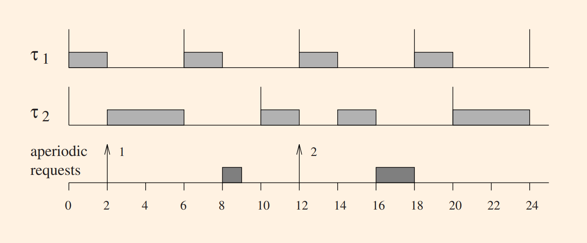
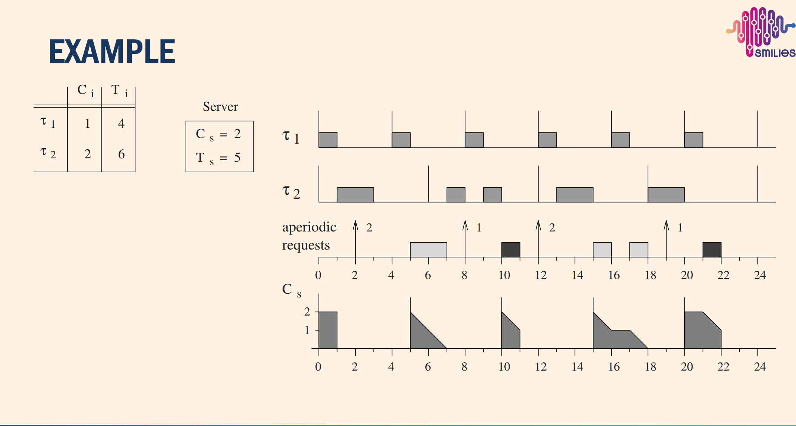

# Scheduling Mixed Tasks

In real application heterogeneous task sets are used (both periodic & aperiodic tasks)

Priority servers reserve execution capacity for aperiodic and sporadic tasks, improving their response times while ensuring periodic real-time tasks remain fully schedulable and protected.

## BACKGROUND SCHEDULING

1. Periodic tasks are scheduled using RM (rate monotonic scheduling)
2. Aperiodic tasks are scheduled in background, when no periodic instance is ready

### Characteristics of BACKGROUND SCHEDULING

Advantages:

1. Simple
2. Two ready queues are needed
   1. Periodic task queue: RM scheduling is used
   2. Aperiodic task queue: first-come-first-serve scheduling is used

Disadvantages:

1. In case of high periodic workload, response time for aperiodic tasks can be very high
2. Suitable only when aperiodic tasks are soft real-time

_BACKGROUND SCHEDULING_

## POLLING SERVER

Here we have a new terms, **SERVERS**. What is a server ?

A server is a special periodic tasks that created to server aperiodic tasks soon as possible.

Characteristics of a server

- Ts: period of the server
- Cs: capacity/budget of the server.

For Polling servers, it is scheduled using **RM** as other periodic tasks.

The main difference between a **POLLING SERVER** from a **DEFERRABLE SERVER** is a polling server consumes its budget either running an aperiodic task or immediately if no aperiodic tasks is ready.

The budget or capacity of a Polling Server is recharged at the beginning of each new period.

_Example of Polling Server_

### FEASIBILITY OF POLLING SERVER

Considering **n** period tasks each with utilization $U_i$ and a polling server with utilization
$U_s=C_s/T_s$, the task set is feasible with RM if

$$
\prod_{i=1}^{n} (U_i + 1) \le \frac{2}{U_s + 1}
$$

### DIMENSIONING THE POLLING SERVER

How to set $C_c$ and $T_s$ so that the resulting scheduling is feasible? => we are looking for the
polling server maximum utilization factor: $U_s^{max}$

$$
P \;\overset{\text{def}}{=} \prod_{i=1}^{n} (U_i + 1)
$$

 

$$
U_{s}^{max} = \frac{2-P}{P}
$$

Given $U_s^{\max}$, the rule of thumb is the following:

- Set $U_s$ at most equal to $U_s^{\max}$
- Set $T_s$ as the period of the periodic task with the shortest period (the polling server becomes the highest-priority task)
- Set $C_s = U_s \, T_s$
