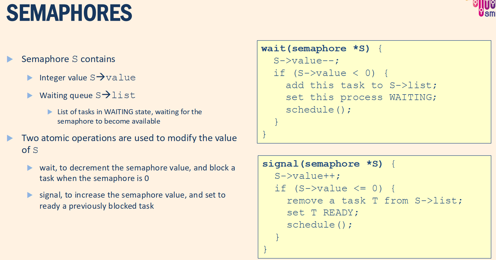
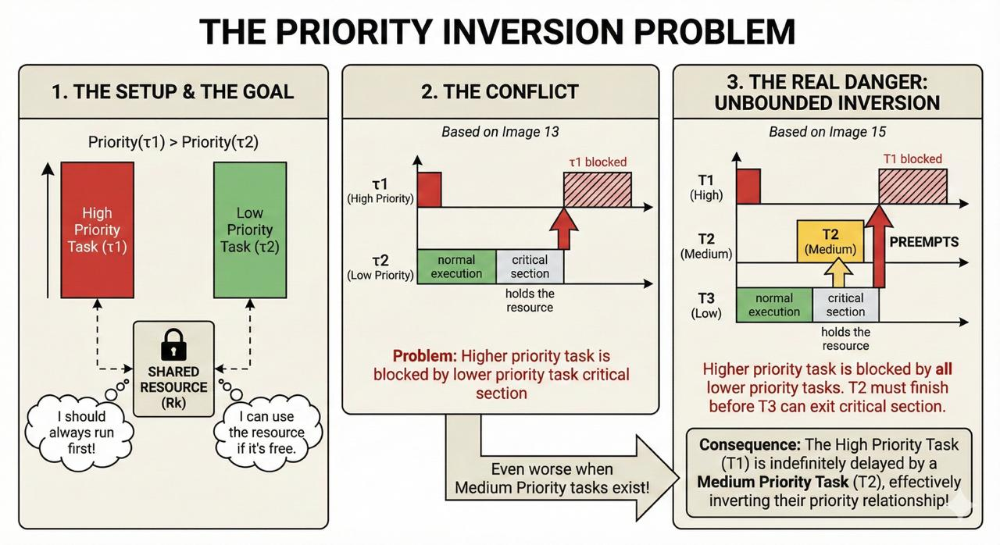
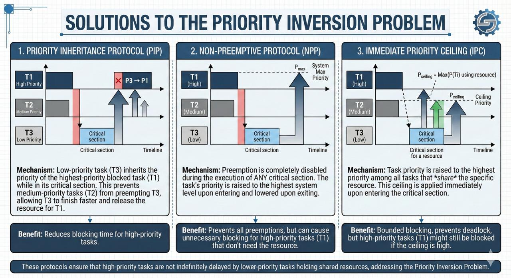
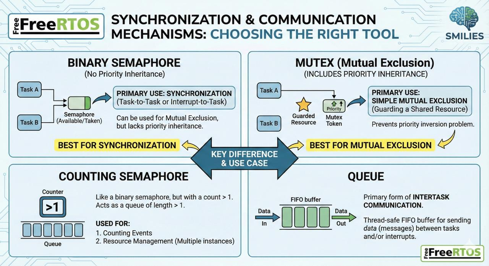

# Shared resources

**Q -** what is resource?

> Any software structure used by **processes** to **advance** its **execution** like Data structure, set of variables, main memory area, file, set of registers of a peripheral device

We have two types of the resources:

1. Private resource (a resource dedicated to a particular process)

3. Shared resource (a resource that can be used by more tasks)
   1. Shared exclusive resource (a shared resource protected against concurrent accesses that means only one process at a time can use the resource)

## Race problem

Actually, the `count++` process is not a single instruction for CPU.
May in the middle of that operation the CPU preempts the process and run other instructions and our shared resource changed in this preemption. So we must find a solution for race problem. The lecturer presents these solutions:

1. Disabling the interrupts
2. SPINLOCK — BUSY WAITING
3. Semaphores

So now, we explain each of these solutions.

### Disabling the interrupts

The race problem happens when CPU preempts a task with a interrupt, if we disable it the instructions of the task run together.

Advantages:

- simple

Disadvantages:

- Interrupt latency not predictable → bad for real time
- Disable preemption may prevent scheduling of higher priority independent tasks.

### SPINLOCK — BUSY WAITING

Allows a thread to "spin" (actively wait) until it acquires a lock.

Typically used in multiprocessor systems where waiting is expected to be brief

Advantages:

- Simple and fast for short waits
- No context switching overhead

Disadvantages:

- Wastes CPU cycles while waiting (busy-waiting)
- Not ideal for single-processor systems

### Semaphores

### Semaphores vs busy waiting

| Aspect                                  | Busy Waiting                                                               | Semaphore                                                                                         |
| --------------------------------------- | -------------------------------------------------------------------------- | ------------------------------------------------------------------------------------------------- |
| Waiting behaviour                       | Process keeps running while waiting (spins in a loop).                     | Process is moved to WAIT state if it cannot enter critical section; a context switch takes place. |
| CPU usage while waiting                 | Continuously consumes CPU cycles.                                          | Does not consume CPU while blocked; CPU can run other tasks.                                      |
| Performance note                        | 1 spin of busy waiting ≈ 1 unit of CPU work.                               | 1 context switch costs ≈ 1000× CPU cycles of a single busy-wait spin.                             |
| Small critical section (few CPU cycles) | Better choice: only a few CPU cycles are wasted; no context switch needed. | Worse: context-switch overhead is large compared to the short critical section.                   |
| Big critical section (many CPU cycles)  | Worse choice: a whole time slice can be wasted spinning.                   | Better: task sleeps while waiting; the time slice is not wasted doing busy waiting.               |

## THE PRIORITY INVERSION PROBLEM AND solutions

### solution

## Our tools in freeRTOS

